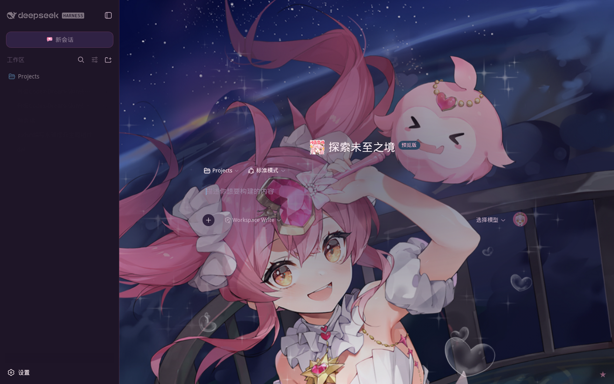
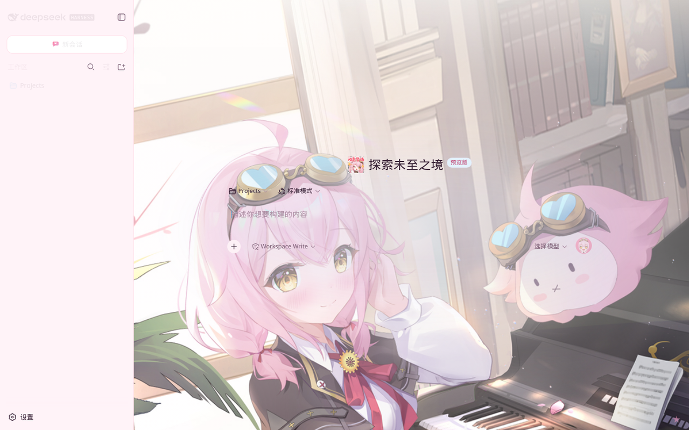

# dsh-client-ui-theme-taffy — 永雏塔菲主题

为 DeepSeek Harness（dsh）Web 界面提供永雏塔菲（AceTaffy）配色与场景背景的主题插件。

<p align="center">
  
  <br><sub>暗色主题</sub>
</p>

<p align="center">
  
  <br><sub>浅色主题</sub>
</p>

## 素材来源

全部素材取自 [永雏塔菲图片站 (image.acetaffy.org)](https://image.acetaffy.org/) 与
[永雏塔菲百科 (acetaffy.org)](https://acetaffy.org/)，构建时内联为 data URI，离线可用、不依赖热链。

| 原始文件 | 来源（图片站路径） | 用途 |
| --- | --- | --- |
| `assets/art-dark.jpg` | `装扮&收藏集/永雏塔菲/背景图/image1_landscape.jpg`（夜空） | 暗色全屏背景 |
| `assets/art-light.jpg` | `装扮&收藏集/永雏塔菲/背景图/image3_landscape.jpg`（粉玫瑰） | 浅色全屏背景 |
| `assets/icons/LOGO96_URI.png` | 永雏塔菲百科官方 logo | 标签页 favicon |
| `assets/icons/EMO_HERO_URI.png` | 表情包「闪亮登场」 | 首页吉祥物 |
| `assets/icons/EMO_SEND_URI.png` | 表情包「星星眼」 | 发送按钮 |
| `assets/icons/EMO_HEADER_URI.png` | 表情包「嘻嘻喵」 | 会话头部头像 |

## 安装

```
dsh plugin --profile web add /path/to/dsh-theme-taffy
```

并在 `~/.dsh/profiles/web/cordis.patch.yml` 的 insert 列表加入 roster 行：

```yaml
- insert:
    - id: taffy-theme
      name: 'dsh-client-ui-theme-taffy'
```

重启 web 服务生效。

## 构建

```
node scripts/build.mjs   # 读取 assets/ + src/client.template.js，生成 lib/client.js
```
